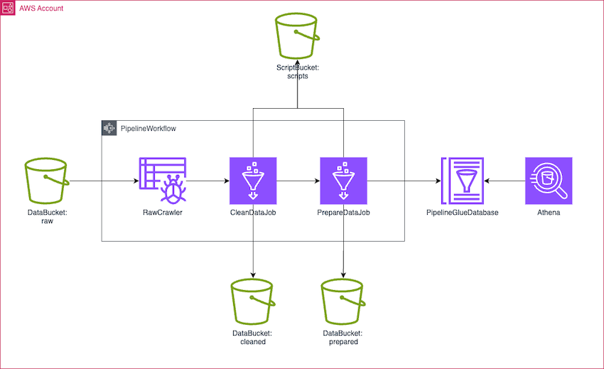
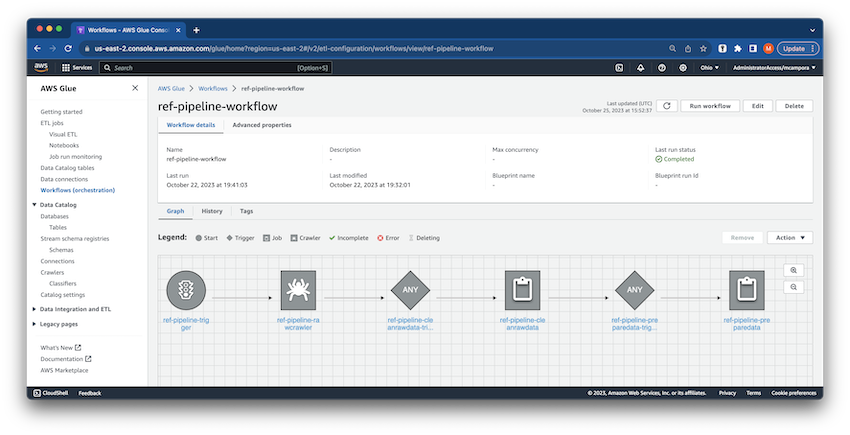
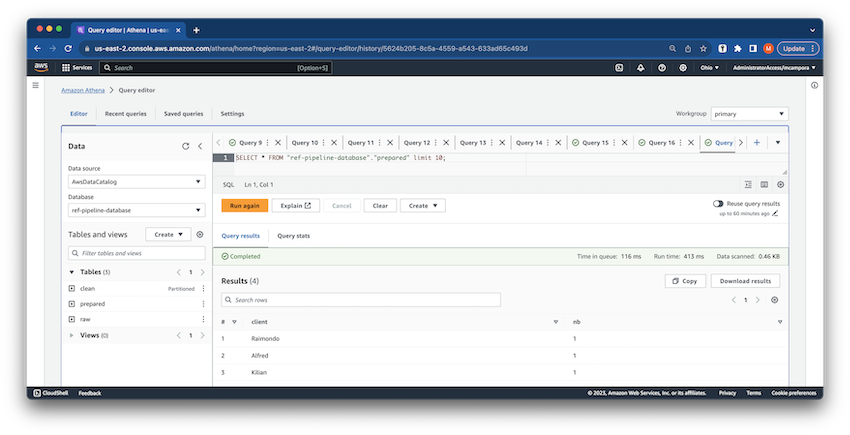

# Pipeline

Simple demo on how to implement a data pipeline with Glue and Athena.  



# Deploy
Define AWS credentials in your terminal.  
```bash
export AWS_ACCESS_KEY_ID="..."  
export AWS_SECRET_ACCESS_KEY="..."  
export AWS_SESSION_TOKEN="..."  
```

Deploy the AWS resources (the workflow, crawler, jobs) and pyspark scripts using: 
```bash
./deploy.sh
```



# Launch
You can use the provided script to:
- Create a new csv file with a handfull of raws.  
- Push the new file to S3.  
- Trigger the workflow.  
- A crawler is infering raw data schema.  
- A first job is processing new raw data, clean the rows, save the result in a new table as parquet files.  
- A second job is using the previous table, is computing an agregate and is saving it in a new table as parquet files.  

Wait for the end of the pipeline, query the table using Athena to check the result.  

```bash
./trigger.sh
```



